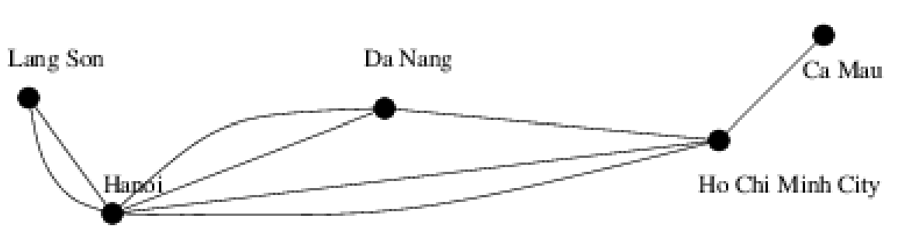
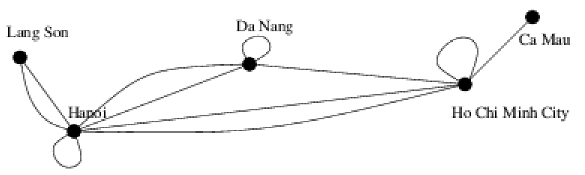
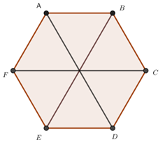
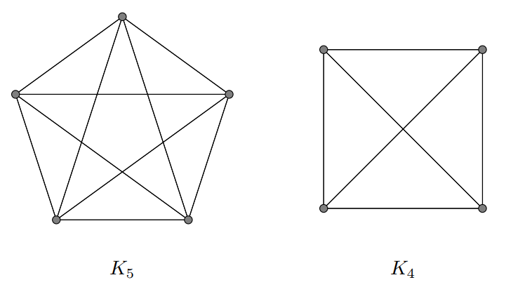
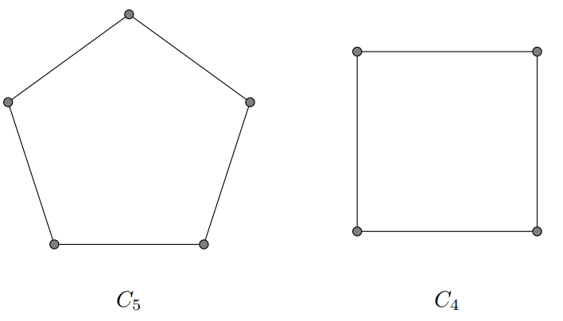
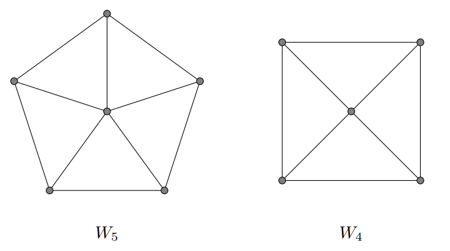
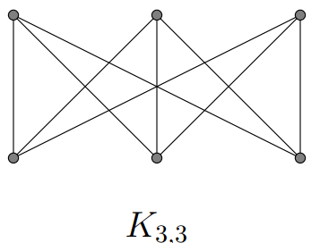
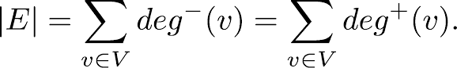

# Graph
## Concept
**Graph (G)**:  is a pair of Vertices (V) and Edges (E).
Two type of graph:
<ul>
<li>Undirected graph</li>
<li>Directed graph</li>
</ul>
<br>

**Undirected graph**
<ul>
<li>Simple graph: Each edge connects two different vertices </li>
<li>Multigraph: Graphs that may have multiple edges connecting the same vertices </li>
<li>Pseudograph: edges that connect a vertex to itself  </li>
</ul>

**Directed graph**
Directed grap include vertices and directed edges


**The degree of a vertex**
The degree of a vertex deg(v): is the number of edges connect with vertice

deg(A) = 3

**Complete Graphs**: n vertices (Kn), 2 vertices have 1 edge.


**Cycle Graphs**:  n vertices (Cn), vertices = edges.


**Wheels Graphs**:  n vertices (Cn), is like cycle graph but it has 1 vertice in center.


**Complete Bipartite Graphs**:  have 2 group: m and n vertices (Km,n)
1 vertice in group m and 1 vertice in group n create 1 edge


## Representing Graphs
**Adjacency Lists**: one vertice has 1 list of adjacent vertices. 
**Adjacency Matrices**: graph have n vertices is represented by square matrix n*n. If (i, j) is a edge of graph, a(i, j) = 1. Else a(i, j) = 0.
**Edge List**: is a list include top and bottom vertices of edge.

##### Isomorphism

## Theorem
**The Handshaking Theorem** G is an undirected graph with E edges.


Directed graph 


## Breadth-First Search (BFS) (queue)
```c++
void BFS(int a){
    queue<int> q;
    q.push(a);
    while(!q.empty()){
        int u = q.front();
        q.pop();
        mark[u] = 1;
        cout << u << " ";
        for(int v : adj[u])
            if(!mark[v]) q.push(v);
    }
}
```
## Depth-First Search (DFS) (stack)
```c++
void DFS(int u){
    cout << u << " ";
    mark[u] = 1;
    for(int v : adj[u])
        if(!mark[v]) DFS(v);
}
```
## Dijkstra’s Algorithm
```c++
#include <bits/stdc++.h>
using namespace std;
#define INF 0x3f3f3f3f

typedef pair<int, int> iPair;

class Graph {
    int V; 

    list<pair<int, int> >* adj;

public:
    Graph(int V); 

    void addEdge(int u, int v, int w);

    void shortestPath(int s);
};

Graph::Graph(int V)
{
    this->V = V;
    adj = new list<iPair>[V];
}

void Graph::addEdge(int u, int v, int w)
{
    adj[u].push_back(make_pair(v, w));
    adj[v].push_back(make_pair(u, w));
}

void Graph::shortestPath(int src)
{

    priority_queue<iPair, vector<iPair>, greater<iPair> >
            pq;

    vector<int> dist(V, INF);

    pq.push(make_pair(0, src));
    dist[src] = 0;

    while (!pq.empty()) {
        int u = pq.top().second;
        pq.pop();
        list<pair<int, int> >::iterator i;
        for (i = adj[u].begin(); i != adj[u].end(); ++i) {
            int v = (*i).first;
            int weight = (*i).second;
            if (dist[v] > dist[u] + weight) {
                dist[v] = dist[u] + weight;
                pq.push(make_pair(dist[v], v));
            }
        }
    }

    printf("Vertex Distance from Source\n");
    for (int i = 0; i < V; ++i)
        printf("%d \t\t %d\n", i, dist[i]);
}

// Driver's code
// code geeksforgeeks.org
int main(){
    int V = 9;
    Graph g(V);

    g.addEdge(0, 1, 4);
    g.addEdge(0, 7, 8);
    g.addEdge(1, 2, 8);
    g.addEdge(1, 7, 11);
    g.addEdge(2, 3, 7);
    g.addEdge(2, 8, 2);
    g.addEdge(2, 5, 4);
    g.addEdge(3, 4, 9);
    g.addEdge(3, 5, 14);
    g.addEdge(4, 5, 10);
    g.addEdge(5, 6, 2);
    g.addEdge(6, 7, 1);
    g.addEdge(6, 8, 6);
    g.addEdge(7, 8, 7);

    // Function call
    g.shortestPath(0);

    return 0;
}

```
