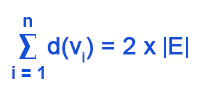

# Graph
## Concept
**Graph (G)**:  is a pair of Vertices (V) and Edges (E).
Two type of graph:
<ul>
<li>Undirected graph</li>
<li>Directed graph</li>
</ul>
 

**Undirected graph**
<ul>
<li>Simple graph: Each edge connects two different vertices </li>
<li>Multigraph: Graphs that may have multiple edges connecting the same vertices </li>
<li>Pseudograph: edges that connect a vertex to itself  </li>
</ul>

**Directed graph**
Directed grap include vertices and directed edges

**The degree of a vertex**
The degree of a vertex deg(v): is the number of edges connect with vertice

deg(A) = 3

**Complete Graphs**: n vertices (Kn), 2 vertices have 1 edge.

**Cycle Graphs**:  n vertices (Cn), vertices = edges.

**Wheels Graphs**:  n vertices (Cn), is like cycle graph but it has 1 vertice in center.

**Complete Bipartite Graphs**:  have 2 group: m and n vertices (Km,n)
1 vertice in group m and 1 vertice in group n create 1 edge

## Representing Graphs
**Adjacency Lists**: one vertice has 1 list of adjacent vertices. 
**Adjacency Matrices**: graph have n vertices is represented by square matrix n*n. If (i, j) is a edge of graph, a(i, j) = 1. Else a(i, j) = 0.
**Edge List**: is a list include top and bottom vertices of edge.

##### Isomorphism

## Theorem
**The Handshaking Theorem** G is an undirected graph with E edges.

Directed graph 

## Breadth-First Search (BFS) (queue)

## Depth-First Search (DFS) (stack)

## Dijkstra’s Algorithm