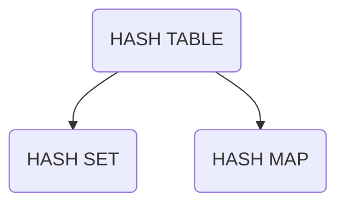
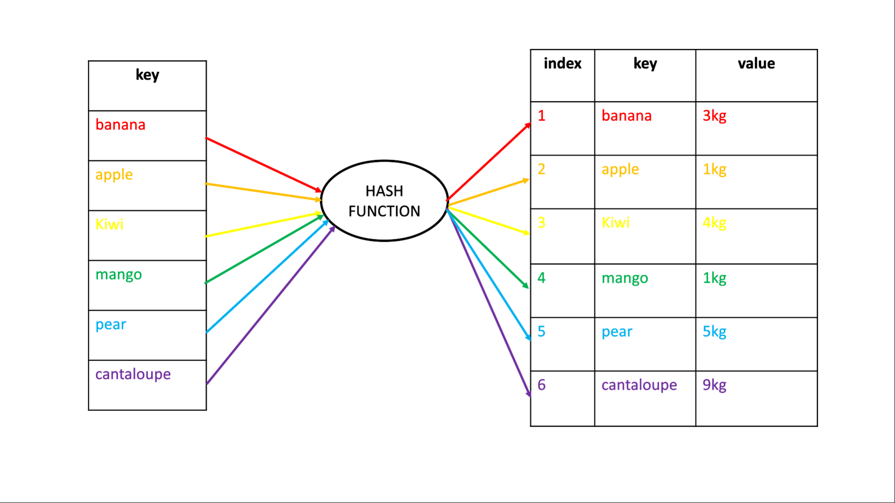

# HASH TABLE
### Concept
**Hash Table**: is a data structure which organize data using hash functions in order to suport quick search, add, remove.
**Hash Function**: will depend on the range of key values and the number of bucket.
**Hash Set**: manage key. 
**Hash Map**: manage key, value.
**Collision resolution**

### Example

