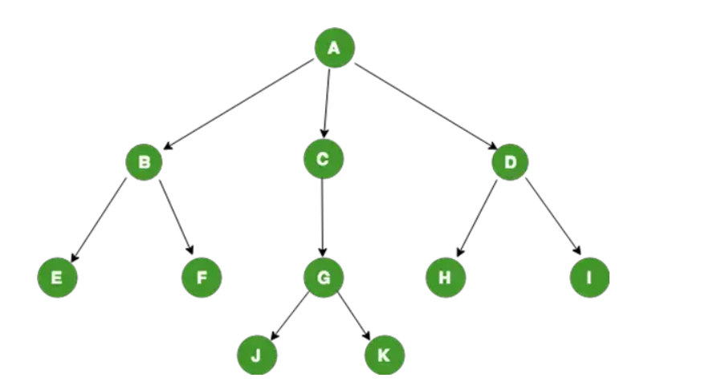

# TREE
#### Concept
**Tree**: is a connected undirected graph with no simple circuits. Consequently, a tree must be a simple graph.
In computer sience, tree is recursively defined non-linear (hierarchical) data structure. It comprises nodes linked together in a hierarchical manner. Each node has a label and the references to the child nodes.

**Exemple**

-A is the root of the tree
-A is Parent of B, C and D
-B is child of A
-B, C and D are siblings
-A is grand-parent of E, F, G, H and I
-E, F, G, H and I is leaf

#### Types of Trees in Data Structure
1. #### N-ary Tree
   The maximum number of children that node can have is N -> we call **N-ary Tree**. N = 3 we can **call 3-ary Tree** or **Ternary tree**. N = 2 we can **call 2-ary Tree** or **Binary tree**. If each parent have exactly m children -> we call **full N-ary Tree**. **Binary Search Tree** is a Binnary Tree that the value of all left node < the value of all right node.
2. #### AVL Tree (Adelson, Velski và Landis)
   AVL Tree is a Binary Search Tree that the Balance Factor = 0 or 1

#### Code binary tree

### NODE
```c++
struct node{
    int data;
    struct node *pleft;
    struct node *pright;
};
typedef struct node NODE;
typedef NODE* TREE;
```

### Create tree
```c++
void create_tree(TREE &t){
    t = NULL;
}
```

### Add node
```c++
void add_node(TREE &t, int x){
    if(t == NULL) {
        NODE *p = new NODE;
        p->data = x;
        p->pleft = NULL;
        p->pright = NULL;
        t = p;
    }
    else{
        if(t->data > x){
            add_node(t->pleft, x);
        }
        else if(t->data < x){
            add_node(t->pright, x);
        }
    }
}
```

### Traverse
```c++
void traverseNLR(TREE t){
    if(t != NULL){
        cout<<t->data<<" ";
        traverseNLR(t->pleft);
        traverseNLR(t->pright);
    }
}
void traverseNRL(TREE t){
    if(t != NULL){
        cout<<t->data<<" ";
        traverseNRL(t->pright);
        traverseNRL(t->pleft);
    }
}
```

### Delete node have 0 or 1 child
```c++
void delete_node(TREE &t, int data){
    if(t == NULL) return;
    else{
        if(data < t->data){
            delete_node(t->pleft, data);
        }
        else if(data > t->data){
            delete_node(t->pright, data);
        }
        else{
            NODE *X = t;
            if(t->pleft == NULL) t = t->pright;
            else if(t->pright == NULL) t = t->pleft;
            delete X;
        }
    }
}
```